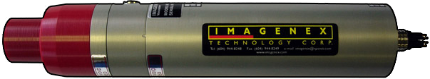

     
    
    <h1>
        imagenex831l 
        
            An unofficial Rust library for interacting with data from
            <a href="https://imagenex.com/products/831l-pipe-profiling">            
                IMAGENEX 831L Pipe Profiling Sonars
            </a>.
        
    </h1>

[![License][shield-license]][url-license]
![Programming Language][shield-language]
[![Tests][shield-tests]][url-tests]
[![Coverage][shield-codecov]][url-codecov]

[shield-license]: https://img.shields.io/github/license/johnlettman/imagenex831l?style=for-the-badge
[url-license]: ./LICENSE

[shield-language]: https://img.shields.io/github/languages/top/johnlettman/imagenex831l?style=for-the-badge

[shield-tests]: https://img.shields.io/github/actions/workflow/status/johnlettman/imagenex831l/ci.yaml?style=for-the-badge&label=tests
[url-tests]: https://github.com/johnlettman/imagenex831l/actions/workflows/ci.yaml

[shield-codecov]: https://img.shields.io/codecov/c/github/johnlettman/imagenex831l?style=for-the-badge
[url-codecov]: https://app.codecov.io/gh/johnlettman/imagenex831l
